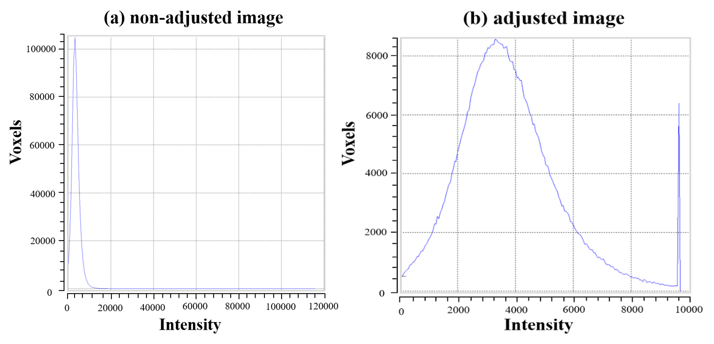
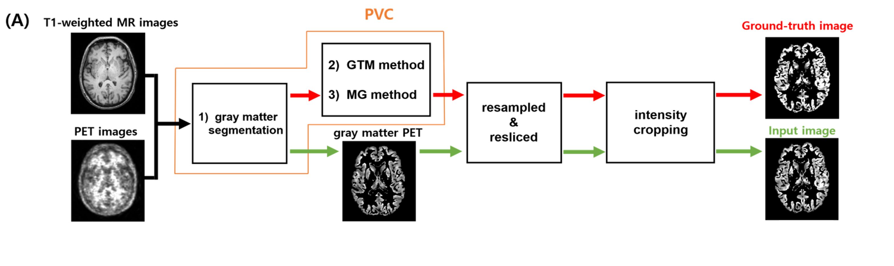
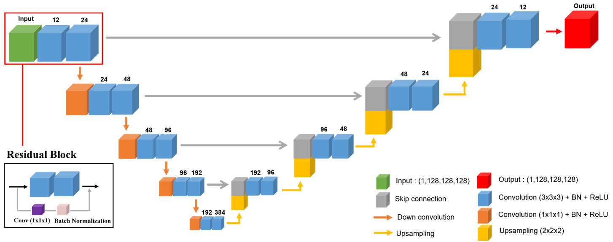
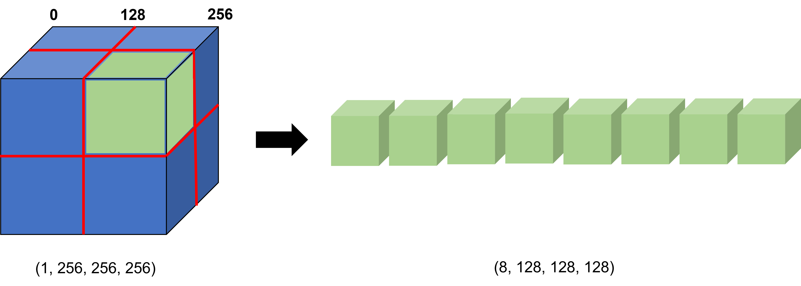
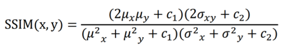
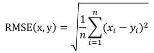
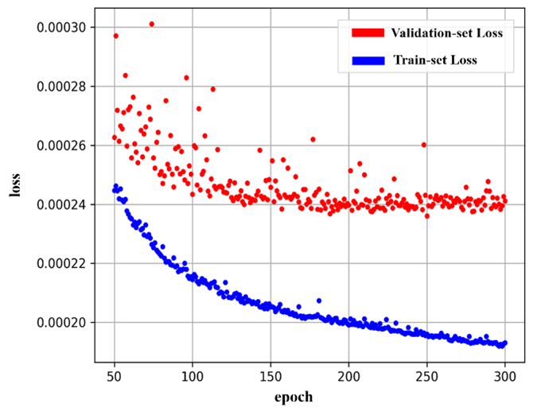
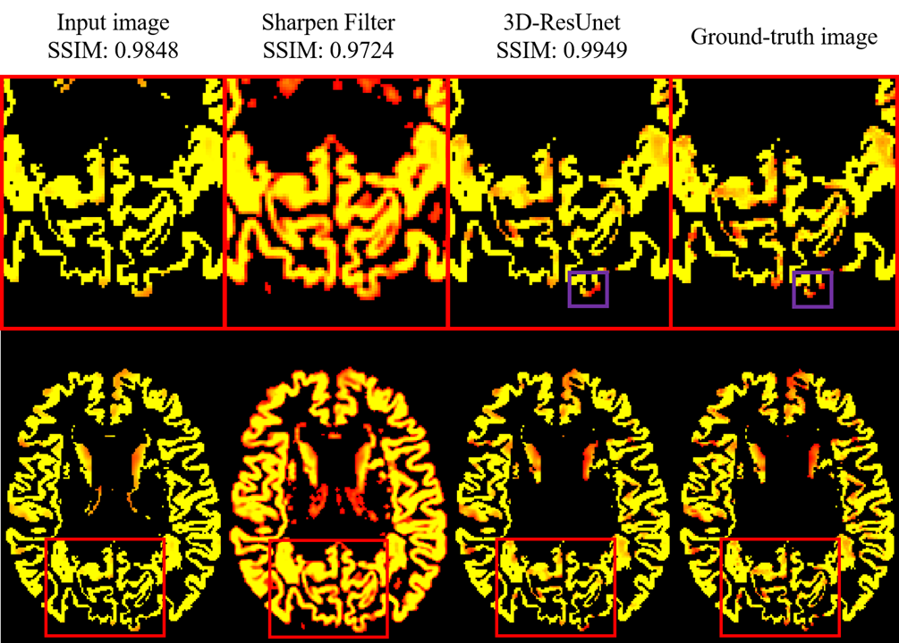
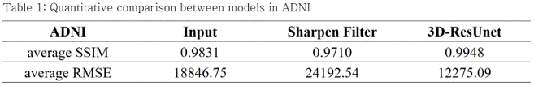

# 소개
본 연구의 목표는 오랜 시간이 걸리는 기존의 PVC 과정을 딥러닝으로 대체하여 정확도를 유지하면서도 처리 시간을 단축하고자 함.

# 순서: 
1. 데이터 셋 소개
2. 데이터 전처리
3. 딥러닝 모델, 3D-ResUnet
4. 학습 방법
5. 정량적 평가 방법
6. 실험 결과 및 

## 1. 데이터 셋 소개
본 연구에서 사용한 데이터는 알츠하이머 병 뇌 영상 데이터베이스(ADNI)로 부터 획득함.  

ADNI 데이터셋에서 694명의 3D-PET영상을 사용하였으며 이 중 550명의 환자 영상을 훈련 데이터로, 50명 환자 영상을 검증 데이터로, 나머지 94명을 테스트 데이터로 설정하고 학습 및 실험을 진행함.

(550, 256, 256, 256, 1) # __Train data shape__  
(50, 256, 256, 256, 1) # __Validation data shape__  
(94, 256, 256, 256, 1) # __Test data shape__  

## 2. 데이터 전처리
딥러닝 모델에 넣어주기 위해 모든 영상의 크기를 일정하게 통일함.  

SPM 패키지를 이용하여 영상 데이터의 크기를 __표준뇌 참조 영상__ 과 같아지도록 **Reslice**하여 준비함.  
(표준뇌 영상 크기: 복셀 사이즈 1 x 1 x 1 mm3, 크기 256 x 256 x 256).

PET영상은 주입한 방사성 물질의 양, 주입한 시간 등에 따라서 영상의 강도가 매우 달라지는 특성이 있음.
그러하여, PET 영상의 복셀 값 분포를 0에서 1사이의 값 (MinMaxScaler)으로 매핑하고, 강도 값(intensity)의 히스토그램을 분석하여 상위 99% 이상은 99%의 값으로 처리하는 intensity cropping을 시행함[그림 1].  

</>

* [그림 1] 특정 이미지의 (a) 원래 이미지의 복셀 값 범위, (b) intensity cropping을 실시하여 보정한 이미지의 복셀 값 범위 *
</>

</>

* [그림 2] 데이터 전처리 전체 흐름도 *
</>  

## 3. 딥러닝 모델, 3D-ResUnet
본 연구에서는 사용한 **3D-ResUnet [그림 3]** 은 [패치 기반(patch-based)](https://github.com/wjh1065/3D-Patch-Based-Training) [그림 4]으로 변형하여 사용함.  

</>

* [그림 3] 3D-ResUnet의 구조 도식화 *
</>  

</>

* [그림 4] Patch 학습 예시 *
</>  

(550, 256, 256, 256, 1) -> (4400, 128, 128, 128, 1) # Train __*patch*__ data shape  
(50, 256, 256, 256, 1) -> (400, 128, 128, 128, 1)   # Validation __*patch*__ data shape  
(94, 256, 256, 256, 1) -> (752, 128, 128, 128, 1)   # Test __*patch*__ data shape  

## 4. 학습 방법
"PVC 처리 전 PET 영상 데이터"를 __입력 데이터__ 로 사용하였고, "PVC 처리 후 PET 영상 데이터"는 __정답 데이터__ 로 사용하여 학습을 진행함.  

최소제곱에러(Mean Square Error, MSE, 식 (1))를 손실함수로 사용하여, 입력 데이터와 정답 데이터간의 차이를 줄이도록 함.  

</>

* [식 1] 최소제곱에러 공식 *
</>  

본 연구에서는 패치를 이용하여 한 사람의 영상을 8개의 패치(각 영상의 실제 크기: 128 x 128 x 128 voxels)로 나누고, 미니배치의 크기(batch size)를 4로 하였으며, 총 300번의 에폭(epoch) 동안 학습을 진행하였다. 최적화 알고리즘(optimizer)는 Adam을 사용했다.  

모든 구현은 유닉스 상(Ubuntu 18.04.5 LTS)의 Python 버전 3.8.8에서 구글 텐서플로우 (TensorFlowTM) 버전 2.5.0, 케라스(Keras) 버전 2.5.0으로 구현되었다. 학습에 사용된 하드웨어 정보는 다음과 같다 (CPU: Intel i7-6700@3.4GHz, GPU: Nvidia RTX 3090 24GB, memory: 48GB).

## 5. 정량적 평가 방법
모델의 평가 방법은 정답 데이터와의 유사성을 비교하는 __구조적 유사 지수(Structural Similarity Index, SSIM, 식(2))__ 와 정답 데이터간의 오차율을 확인하는 __평균 제곱근 오차(Root Mean Square Error, RMSE, 식(3))__ 를 이용함.

</>

* [식 2] 구조적 유사 지수 공식 *
</>  

</>

* [식 3] 평균 제곱근 오차 공식 *
</>  

이전의 선행연구가 없으므로, 비교할 기준모델 (baseline model)로는 SciPy 패키지의 선명화 효과 필터(sharpen filter)를 사용함.  

## 6.  실험결과 및 결론
그림 5는 최종 모델의 학습 곡선을 보여줌.  과적합을 막기 위해 검증 데이터에서의 손실이 더 이상 증가하지 않는 정도에서 학습을 멈춤.  

</>

* [그림 5] ADNI 데이터에 대해 3D-ResUnet의 학습 및 검증 손실 그래프 *
</> 

그림 6은 ADNI 테스트 데이터 첫번째 영상을 예시로 그린 것임.  

</>

* [그림 6] 테스트 데이터에서의 모델 처리결과 예시 *
</>

* (입력 영상, 선명화 효과 필터의 결과 영상, 3D-ResUnet의 결과 영상, SPM으로 처리된 정답 영상) *
</>  

표 1은 ADNI 테스트 데이터에서 모델들의 정량적 성능 평가를 보여줌.  

</>

* [표 1] ADNI 테스트 데이터에서 모델들의 정량적 성능 평가 *
</>

SPM을 통한 PVC 과정은 영상분할 작업 10분, GTM 방법 90분, MG 방법 10분이 소요됨.  
본 연구에서 제안한 방법은 영상분할 작업은 제외하고 GTM과 MG 방법을 딥러닝 알고리즘으로 대체함.  
한 사람당 처리시간은 평균 5.4초로 SPM처리 보다 1100배가량 빠른 처리 속도를 보여줌.  

